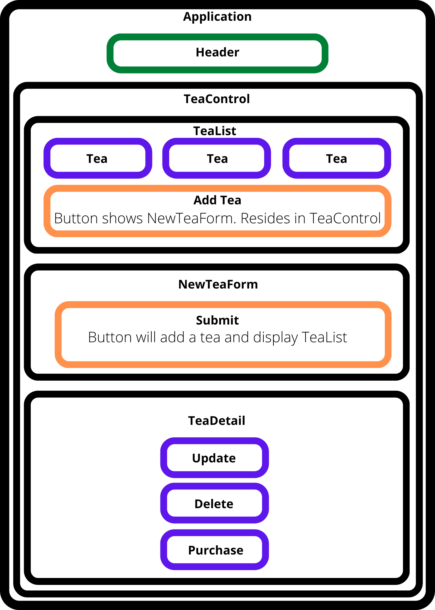

# Tea Shop Inventory tracker
## _React Independent Project_

An application built in React that tracks inventory for an imaginary local tea shop.

## Technology Utilized
- React
- JavaScript
- HTML
- CSS
- Bootstrap
- Markdown

### Description
Application deasigned to utilize full CRUD functionality. Users can view tea details, add, update, and delete teas, and buy tea. When a user purchases a tea, the quantity is reduced by one oz.



### Setup/Installation Requirements
1. Go to GitHub
2. Clone git repository to local machine
``` $ git clone https://github.com/justicepelteir/tea-shop-inventory-tracker.git ```
3. Navigate to root folder and open directory in your terminal
4. Build environment by executing following command in terminal to install packages:
``` $ npm install ```
Server:
5. Start server executing following command in terminal:
``` $ npm start ```
6. It should automatically open up the server if not open up your browser and go to:
``` http://localhost:3000/ ```

## License

MIT

Copyright (c) 2022 Justice Douglas

Permission is hereby granted, free of charge, to any person obtaining a copy of this software and associated documentation files (the "Software"), to deal in the Software without restriction, including without limitation the rights to use, copy, modify, merge, publish, distribute, sublicense, and/or sell copies of the Software, and to permit persons to whom the Software is furnished to do so, subject to the following conditions:

The above copyright notice and this permission notice shall be included in all copies or substantial portions of the Software.

THE SOFTWARE IS PROVIDED "AS IS", WITHOUT WARRANTY OF ANY KIND, EXPRESS OR IMPLIED, INCLUDING BUT NOT LIMITED TO THE WARRANTIES OF MERCHANTABILITY, FITNESS FOR A PARTICULAR PURPOSE AND NONINFRINGEMENT. IN NO EVENT SHALL THE AUTHORS OR COPYRIGHT HOLDERS BE LIABLE FOR ANY CLAIM, DAMAGES OR OTHER LIABILITY, WHETHER IN AN ACTION OF CONTRACT, TORT OR OTHERWISE, ARISING FROM, OUT OF OR IN CONNECTION WITH THE SOFTWARE OR THE USE OR OTHER DEALINGS IN THE SOFTWARE.
